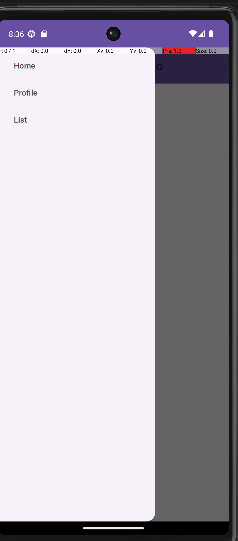
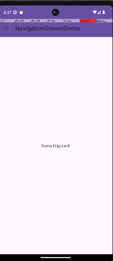
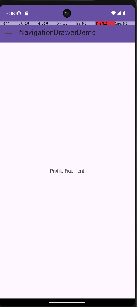
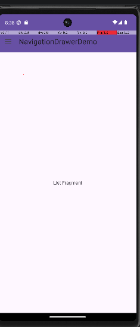

#  NavigationDrawerDemo

##  Description
NavigationDrawerDemo est une application Android développée en Java qui démontre l'utilisation d'un **Navigation Drawer** (menu latéral) et de **Fragments** pour naviguer entre différentes sections dans une seule activité.

---

##  Objectifs
- Implémenter un menu latéral (Navigation Drawer)
- Utiliser des fragments dynamiques
- Gérer la navigation entre plusieurs écrans
- Structurer une application Android moderne

---

##  Fonctionnalités
- Menu latéral avec 3 options :
  - Home
  - Profile
  - List
-  Chargement dynamique des fragments
-  Interface simple et claire

---

## Technologies utilisées
- Java (Android)
- Android Studio
- Fragments
- DrawerLayout & NavigationView

---

##  Structure du projet
- `MainActivity.java` : gestion du Navigation Drawer
- `HomeFragment.java` : fragment principal
- `ProfileFragment.java` : fragment profil
- `ListFragment.java` : fragment liste
- `activity_main.xml` : layout principal avec Drawer
- `drawer_menu.xml` : menu latéral

---

##  Exécution
1. Ouvrir le projet avec Android Studio  
2. Lancer l'application sur un émulateur ou appareil  
3. Cliquer sur ☰ pour ouvrir le menu  
4. Naviguer entre les fragments  

---

##  Démonstration

###  Menu latéral

###  Home Fragment

###  Profile Fragment

###  List Fragment

---

##  Remarques
- Application basée sur fragments dynamiques
- Une seule activité utilisée
- Navigation fluide via Drawer

---

